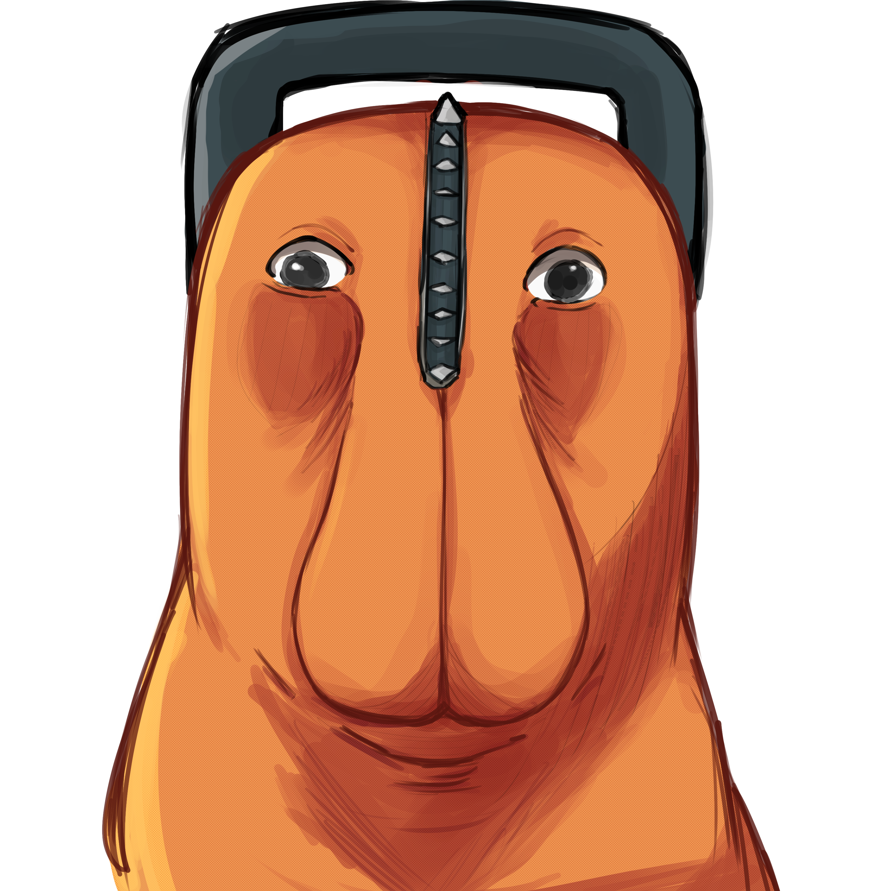

  
  ## Programming Languages
  

  
  
  
  
  
  
  
  
  
  
  
  
  
  
  
  
   

  
  ## Frameworks
  

  
  
  
  
  
  
  
  
  

  
  ## Tools
  

  
  
  
  
  
  
  
  
  
  
  
  
  
  
  

 
 
 

  
 

<h2 align="center" style="margin-top: 50px;"></h2>

  
  
  

